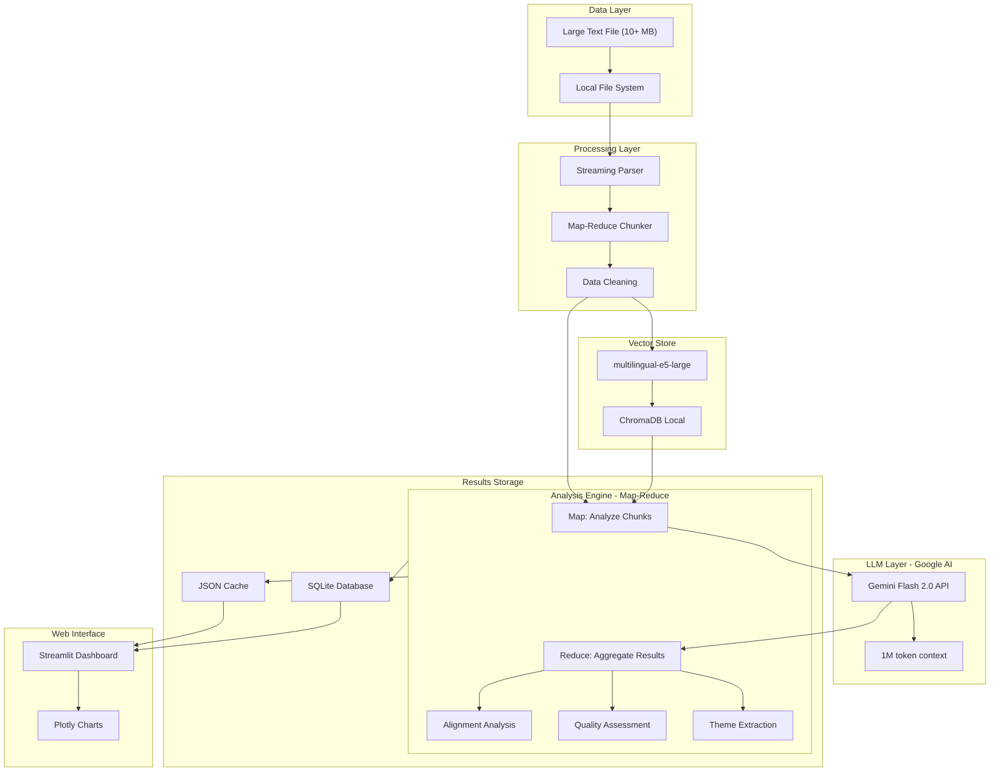
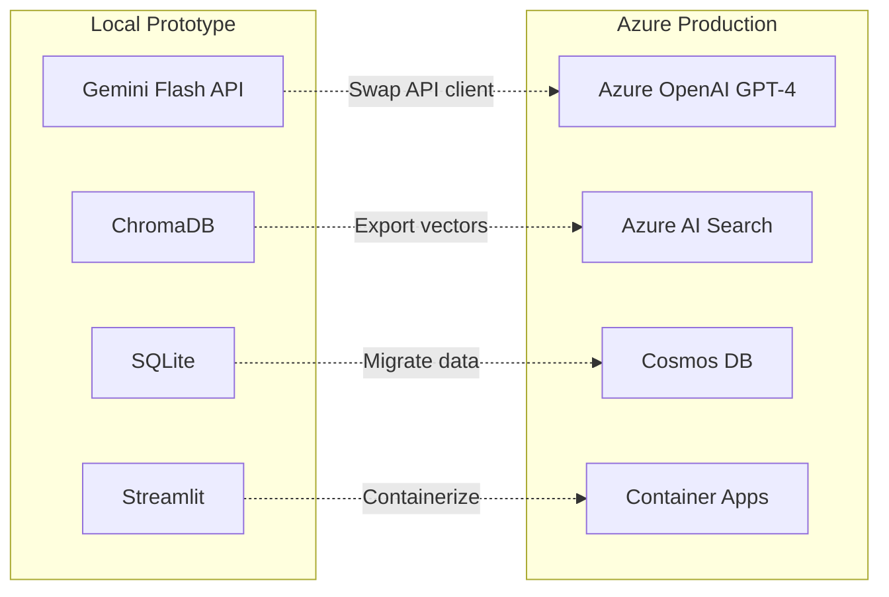

# DO NOT USE THIS PLAN NOW. THIS PLAN IS FOR LATER IMPLEMENTATION
---
name: OKR Analysis Architecture
overview: Build a local prototype OKR analysis system using Python, Google Gemini Flash, and ChromaDB to analyze 125,000+ lines of OKR text data for themes, quality patterns, and alignment insights, with a clear migration path to Azure.
todos:
  - id: local-setup
    content: Set up local development environment with Python, Gemini API, and ChromaDB
    status: pending
  - id: data-pipeline
    content: Build streaming text parser with map-reduce chunking for 10+ MB OKR file
    status: pending
  - id: llm-integration
    content: Integrate Gemini Flash 2.0 with prompt templates for OKR analysis
    status: pending
  - id: vector-search
    content: Implement ChromaDB with multilingual-e5-large embeddings for semantic search
    status: pending
  - id: analysis-engine
    content: Develop map-reduce analysis pipeline for themes, quality scoring, and alignment
    status: pending
  - id: dashboard
    content: Create Streamlit web dashboard with interactive visualizations and filters
    status: pending
  - id: testing
    content: Test with full OKR dataset, validate accuracy, and optimize prompts
    status: pending
  - id: azure-migration
    content: Document Azure migration path and create infrastructure templates
    status: pending
isProject: false
---

# OKR Analysis System - Local Prototype Architecture

## Executive Summary

Build a local prototype OKR analysis system using Python, Google Gemini Flash 2.0, and ChromaDB vector database. The system will process a large text file (10+ MB) containing 125,000+ lines of OKR data using a map-reduce strategy to handle the size constraints. Gemini Flash offers excellent cost-performance balance with a 1M token context window, fast inference, and low API costs. The system will provide AI-powered theme extraction, quality assessment, and alignment analysis through an interactive Streamlit dashboard, with a clear migration path to Azure for production deployment.

## Local Prototype Architecture with Gemini Flash

**Best fit for your requirements**: Local development, low-cost API, excellent quality, Python team




**Tech Stack**:

- **LLM**: Google Gemini Flash 2.0 (1M token context, fast, cost-effective)
- **Vector DB**: ChromaDB (embedded, no server needed)
- **Embeddings**: multilingual-e5-large (best quality for semantic search)
- **Data Processing**: Pandas, streaming parsers
- **Storage**: SQLite (results), JSON files (cache)
- **Frontend**: Streamlit with Plotly for visualizations
- **Orchestration**: Map-reduce pipeline with progress tracking

**Why Gemini Flash 2.0**:

- **Large Context**: 1M token window (can fit ~750k words)
- **Cost**: $0.075 per 1M input tokens, $0.30 per 1M output tokens (very affordable)
- **Speed**: 2-3x faster than GPT-4, similar quality
- **Quality**: Excellent for analysis tasks, structured output
- **Rate Limits**: 1500 requests/minute (sufficient for batch processing)

**Estimated API Costs (One-Time Analysis)**:

- Processing 125k lines (~10MB): $2-5 per full analysis run
- With caching: $0.50-1 for subsequent runs
- Monthly cost (weekly re-analysis): $10-20

**Hardware Requirements**:

- **Minimum**: 8GB RAM, 5GB disk space
- **Recommended**: 16GB RAM, 10GB disk space
- **GPU**: Not required (API-based LLM)

---

## Migration Path to Azure

Once local prototype is validated, migration to Azure is straightforward:




**Migration Advantages**:

1. **Code Reusability**: 80%+ code stays the same
2. **Proven Logic**: Analysis algorithms already validated locally
3. **Risk Reduction**: Know exactly what works before cloud spend
4. **Team Training**: Team familiar with system before production

**Migration Effort**: 1-2 weeks (mostly configuration and deployment)

---

## Implementation Approach: Local First, Then Azure

### Phase 1: Local Prototype (Weeks 1-4)

**Goal**: Build fully functional local system with all core features

**Week 1-2: Foundation**

1. Set up local development environment
2. Install Ollama and download Llama 3.1 model
3. Build text file parser for 10+ MB OKR file
4. Implement smart chunking strategy (handle large file efficiently)
5. Set up ChromaDB for vector storage

**Week 3-4: Analysis & UI**

1. Develop LLM-based analysis modules:
  - Theme extraction with clustering
  - Quality scoring framework
  - Alignment detection algorithms
2. Create Streamlit dashboard with:
  - Theme visualization (word clouds, bar charts)
  - Quality metrics by team/department
  - Alignment heatmaps
  - Search and filter capabilities
3. Implement caching for faster re-runs

**Deliverables**:

- Working local application analyzing full 125k+ lines
- Interactive dashboard accessible at `localhost:8501`
- Performance benchmarks and quality validation
- Documentation for running locally

### Phase 2: Azure Migration (Weeks 5-8)

**Goal**: Deploy to Azure with enterprise features

**Components**:

1. Replace Ollama with Azure OpenAI (GPT-4)
2. Migrate ChromaDB to Azure AI Search
3. Move SQLite to Azure Cosmos DB
4. Deploy Streamlit to Azure Container Apps
5. Add authentication (Azure AD)
6. Implement monitoring and logging
7. Set up CI/CD pipeline

**Deliverables**:

- Production-ready Azure deployment
- Security and compliance documentation
- User training materials
- Handoff to operations team

---

## Key Technical Components

### 1. Text File Parser & Chunking

**File**: `src/data/okr_loader.py`

```python
from typing import List, Dict, Iterator
import re
from dataclasses import dataclass

@dataclass
class OKREntry:
    team: str
    objective: str
    key_results: List[str]
    quarter: str
    raw_text: str

class OKRTextLoader:
    def __init__(self, file_path: str):
        self.file_path = file_path
    
    def parse_okr_file(self) -> List[OKREntry]:
        # Parse large text file with OKR entries
        # Handle various formats (structured, semi-structured, unstructured)
        pass
    
    def chunk_for_processing(self, max_tokens: int = 2000) -> Iterator[List[OKREntry]]:
        # Stream-based chunking for memory efficiency
        # Yield batches that fit within LLM context window
        pass
    
    def extract_metadata(self, text: str) -> Dict:
        # Extract team, quarter, owner from text using regex/patterns
        pass
```

### 2. LLM Analysis Engine (Gemini Flash)

**File**: `src/analysis/llm_analyzer.py`

```python
import google.generativeai as genai
from typing import List, Dict
import json
from concurrent.futures import ThreadPoolExecutor

class OKRAnalyzer:
    def __init__(self, api_key: str):
        genai.configure(api_key=api_key)
        self.model = genai.GenerativeModel('gemini-2.0-flash')
        
    def analyze_chunk_map(self, chunk: List[Dict]) -> Dict:
        # MAP: Analyze single chunk of OKRs
        # Returns: themes, quality scores, issues for this chunk
        pass
    
    def aggregate_results_reduce(self, chunk_results: List[Dict]) -> Dict:
        # REDUCE: Merge and deduplicate results from all chunks
        # Uses Gemini to intelligently merge themes and synthesize insights
        pass
    
    def extract_themes_parallel(self, chunks: List[List[Dict]]) -> Dict:
        # Process all chunks in parallel (respecting rate limits)
        # Then aggregate with reduce phase
        pass
    
    def assess_quality_batch(self, chunk: List[Dict]) -> Dict:
        # Batch quality assessment for efficiency
        pass
```

### 3. Vector Search with ChromaDB

**File**: `src/search/vector_search.py`

```python
import chromadb
from chromadb.config import Settings
from sentence_transformers import SentenceTransformer
from typing import List, Dict
import numpy as np

class OKRVectorSearch:
    def __init__(self, persist_directory: str = "./data/chroma_db"):
        self.client = chromadb.Client(Settings(
            persist_directory=persist_directory,
            anonymized_telemetry=False
        ))
        self.collection = self.client.get_or_create_collection(
            name="okrs",
            metadata={"description": "OKR embeddings for semantic search"}
        )
        # Use multilingual-e5-large for best quality
        self.embedding_model = SentenceTransformer('intfloat/multilingual-e5-large')
    
    def index_okrs_batch(self, okrs: List[Dict], batch_size: int = 500):
        # Batch embed and store all 125k OKRs
        # Progress tracking with tqdm
        pass
    
    def find_similar_okrs(self, query: str, top_k: int = 10, filter_team: str = None) -> List[Dict]:
        # Semantic search with optional team filtering
        pass
    
    def find_duplicates(self, threshold: float = 0.85) -> List[tuple]:
        # Detect duplicate/similar OKRs across teams
        pass
    
    def compute_team_alignment(self, team_a: str, team_b: str) -> float:
        # Calculate semantic similarity between two teams' OKRs
        # Returns alignment score 0-1
        pass
```

### 4. Streamlit Dashboard

**File**: `src/app/dashboard.py`

```python
import streamlit as st
import plotly.express as px
import plotly.graph_objects as go
from src.analysis.llm_analyzer import OKRAnalyzer
from src.search.vector_search import OKRVectorSearch
import sqlite3

def main():
    st.set_page_config(page_title="OKR Analysis", layout="wide")
    st.title("Enterprise OKR Analysis Dashboard")
    
    # Load cached results from SQLite
    conn = sqlite3.connect("data/okr_results.db")
    
    # Sidebar filters
    st.sidebar.header("Filters")
    teams = load_teams(conn)
    team_filter = st.sidebar.multiselect("Select Teams", teams, default=teams[:5])
    quarter_filter = st.sidebar.selectbox("Quarter", ["All", "Q1", "Q2", "Q3", "Q4"])
    
    # Main tabs
    tab1, tab2, tab3, tab4 = st.tabs([
        "Overview", 
        "Theme Analysis", 
        "Quality Metrics", 
        "Alignment & Gaps"
    ])
    
    with tab1:
        col1, col2, col3, col4 = st.columns(4)
        col1.metric("Total OKRs", get_total_okrs(conn))
        col2.metric("Teams Analyzed", len(teams))
        col3.metric("Avg Quality Score", get_avg_quality(conn))
        col4.metric("Themes Identified", get_theme_count(conn))
    
    with tab2:
        st.subheader("Recurring Themes Across Organization")
        fig = create_theme_sunburst(conn, team_filter)
        st.plotly_chart(fig, use_container_width=True)
        
        st.subheader("Theme Details")
        display_theme_table(conn, team_filter)
    
    with tab3:
        st.subheader("Quality Score Distribution")
        fig = create_quality_distribution(conn, team_filter)
        st.plotly_chart(fig, use_container_width=True)
        
        st.subheader("Top Quality Issues")
        display_quality_issues(conn, team_filter)
    
    with tab4:
        st.subheader("Cross-Team Alignment Heatmap")
        fig = create_alignment_heatmap(conn, team_filter)
        st.plotly_chart(fig, use_container_width=True)
```

---

## Analysis Capabilities

### 1. Theme Extraction

- **Method**: LLM-based clustering with semantic similarity
- **Output**: Top 10-20 recurring themes across all OKRs
- **Example Themes**: "Customer Experience", "Operational Efficiency", "Digital Transformation"

### 2. Quality Assessment

**Metrics**:

- **Clarity Score**: Is the objective/key result clearly stated?
- **Measurability Score**: Are there quantifiable metrics?
- **Alignment Score**: Does it align with company strategy?
- **Ambition Score**: Is it challenging yet achievable?

**Prompt Template**:

```
Analyze this OKR for quality:
Objective: {objective}
Key Results: {key_results}

Rate on a scale of 1-10:
1. Clarity: How clear and understandable is it?
2. Measurability: Are the key results quantifiable?
3. Achievability: Is it realistic yet ambitious?
4. Alignment: Does it support broader company goals?

Provide scores and specific improvement suggestions.
```

### 3. Alignment Analysis

- **Vertical Alignment**: Do team OKRs support departmental OKRs?
- **Horizontal Alignment**: Are teams working toward complementary goals?
- **Gap Detection**: Identify strategic areas with insufficient coverage

### 4. Trend Analysis

- Compare OKR quality across quarters
- Identify improving/declining teams
- Track theme evolution over time

---

## Local Development Setup

### Prerequisites

**Install Required Software**:

1. **Python 3.10+**: `brew install python@3.10` (macOS)
2. **Ollama**: `brew install ollama` (macOS) or download from ollama.ai
3. **Git**: For version control

**Download LLM Model**:

```bash
# Start Ollama service
ollama serve

# Download Llama 3.1 8B (4.7GB download, fast inference)
ollama pull llama3.1:8b

# OR download Llama 3.1 70B (40GB download, better quality)
ollama pull llama3.1:70b
```

**Recommendation**: Start with 8B model for development, switch to 70B for final analysis if quality needs improvement.

### Local Infrastructure

**No cloud services needed**:

- **LLM**: Ollama running locally (localhost:11434)
- **Vector DB**: ChromaDB embedded (no server needed)
- **Storage**: Local file system + SQLite
- **Web Server**: Streamlit dev server (localhost:8501)

**Estimated Costs**: $0 (completely free, runs on your machine)

---

## Local Prototype Benefits

### Development Advantages

1. **Zero Cost**: No cloud bills during development
2. **Fast Iteration**: No network latency, instant feedback
3. **Complete Privacy**: Data never leaves your machine
4. **Easy Debugging**: Full control over all components
5. **Offline Capable**: Work without internet connection

### Data Privacy (Local)

1. **No Data Transmission**: OKR data stays on local disk
2. **No Third-Party APIs**: Ollama runs entirely locally
3. **Audit Trail**: All processing logged locally
4. **Easy Compliance**: Demonstrate to security team before cloud deployment

### Performance Expectations (Local)

- **Initial Setup**: 15-30 minutes (install dependencies, download model)
- **First-Time Analysis**: 20-40 minutes for 125k lines (depends on hardware)
- **Subsequent Runs**: 2-5 minutes (with caching)
- **Dashboard Load Time**: < 5 seconds

---

## Development Workflow

### Project Structure (Local Prototype)

```
OKRAnalysis/
├── src/
│   ├── data/
│   │   ├── __init__.py
│   │   ├── okr_loader.py          # Parse large text file
│   │   └── preprocessor.py        # Clean and normalize text
│   ├── analysis/
│   │   ├── __init__.py
│   │   ├── llm_analyzer.py        # Ollama-based analysis
│   │   ├── theme_extractor.py     # Theme clustering
│   │   ├── quality_scorer.py      # Quality assessment
│   │   └── alignment_detector.py  # Alignment analysis
│   ├── search/
│   │   ├── __init__.py
│   │   └── vector_search.py       # ChromaDB integration
│   ├── app/
│   │   ├── dashboard.py           # Main Streamlit app
│   │   ├── pages/                 # Multi-page app
│   │   │   ├── 1_themes.py
│   │   │   ├── 2_quality.py
│   │   │   └── 3_alignment.py
│   │   └── components/            # Reusable UI components
│   │       ├── charts.py
│   │       └── filters.py
│   └── utils/
│       ├── __init__.py
│       ├── llm_client.py          # Abstraction layer (easy Azure swap)
│       └── cache_manager.py       # Result caching
├── data/
│   ├── raw/
│   │   └── okrs.txt               # Your 10+ MB OKR file
│   ├── processed/
│   │   └── okr_entries.json       # Parsed OKR entries
│   ├── chroma_db/                 # ChromaDB persistence
│   └── okr_results.db             # SQLite results database
├── notebooks/
│   ├── 01_data_exploration.ipynb
│   └── 02_prompt_testing.ipynb
├── tests/
│   ├── test_loader.py
│   ├── test_analyzer.py
│   └── test_integration.py
├── scripts/
│   ├── run_analysis.py            # Main analysis script
│   └── setup_ollama.sh            # Ollama setup helper
├── azure_migration/               # Future Azure deployment
│   ├── main.bicep
│   ├── README.md
│   └── migration_guide.md
├── requirements.txt
├── requirements-azure.txt         # Azure-specific deps (for later)
├── .env.example
├── .gitignore
└── README.md
```

### Key Dependencies (Local Prototype)

**File**: `requirements.txt`

```
# Core
python>=3.10
pandas>=2.0.0
numpy>=1.24.0

# Google AI
google-generativeai>=0.3.0

# Vector Database & Embeddings
chromadb>=0.4.22
sentence-transformers>=2.3.0

# Web Framework
streamlit>=1.30.0
plotly>=5.18.0
streamlit-aggrid>=0.3.4

# ML & Analytics
scikit-learn>=1.4.0
scipy>=1.11.0

# Data Processing
pydantic>=2.5.0
python-dotenv>=1.0.0
tqdm>=4.66.0

# Storage
sqlalchemy>=2.0.0

# Utilities
tenacity>=8.2.0  # Retry logic for API calls
aiohttp>=3.9.0   # Async HTTP for parallel processing
```

**File**: `requirements-azure.txt` (for future migration)

```
# Azure SDK (add these when migrating to Azure)
azure-identity>=1.15.0
azure-cosmos>=4.5.0
azure-search-documents>=11.4.0
openai>=1.10.0  # For Azure OpenAI
```

---

## Handling Large Text Files (10+ MB)

### Memory-Efficient Processing Strategy

**Challenge**: 10+ MB text file with 125k+ lines won't fit in LLM context window

**Solution**: Multi-stage processing pipeline

1. **Stream-based Parsing**:
  - Read file in chunks (don't load entire file into memory)
  - Parse OKR entries incrementally
  - Use generators for memory efficiency
2. **Smart Chunking**:
  - Group OKRs by team/department
  - Create overlapping chunks for context preservation
  - Target 2000-4000 tokens per LLM call
3. **Map-Reduce Pattern**:
  - **Map**: Analyze each chunk independently (parallel processing)
  - **Reduce**: Aggregate results across all chunks
  - Example: Extract themes from each chunk, then merge and deduplicate
4. **Caching Strategy**:
  - Cache LLM responses to avoid re-processing
  - Store embeddings in ChromaDB for reuse
  - Save analysis results in SQLite

**File**: `src/data/chunking_strategy.py`

```python
class SmartChunker:
    def __init__(self, max_tokens: int = 2000):
        self.max_tokens = max_tokens
    
    def chunk_by_team(self, okrs: List[OKREntry]) -> Dict[str, List[OKREntry]]:
        # Group OKRs by team for focused analysis
        pass
    
    def create_overlapping_chunks(self, okrs: List[OKREntry]) -> List[List[OKREntry]]:
        # Create chunks with 10% overlap for context
        pass
    
    def estimate_tokens(self, text: str) -> int:
        # Rough token estimation (1 token ≈ 4 chars)
        return len(text) // 4
```

---

## Success Metrics

### Technical Metrics

- **Processing Speed**: Analyze 125k lines in < 30 minutes
- **Accuracy**: 85%+ agreement with human expert reviews (sample validation)
- **Uptime**: 99.5% availability
- **Cost**: Stay within $1000/month budget

### Business Metrics

- **Theme Coverage**: Identify 15-25 meaningful themes
- **Quality Improvement**: Track OKR quality scores quarter-over-quarter
- **Adoption**: 80%+ of HR team uses dashboard monthly
- **Actionability**: Generate 10+ specific improvement recommendations

---

## Next Steps

Once plan is approved, implementation will proceed in this order:

1. Set up Azure environment and resource provisioning
2. Build data ingestion pipeline for Excel/CSV files
3. Integrate Azure OpenAI with prompt engineering for OKR analysis
4. Develop core analysis modules (themes, quality, alignment)
5. Create Streamlit dashboard with visualizations
6. Test with sample OKR data and iterate
7. Deploy to Azure Container Apps
8. Conduct user acceptance testing with HR team
9. Document and hand off

**Estimated POC Timeline**: 6-8 weeks with 1-2 developers